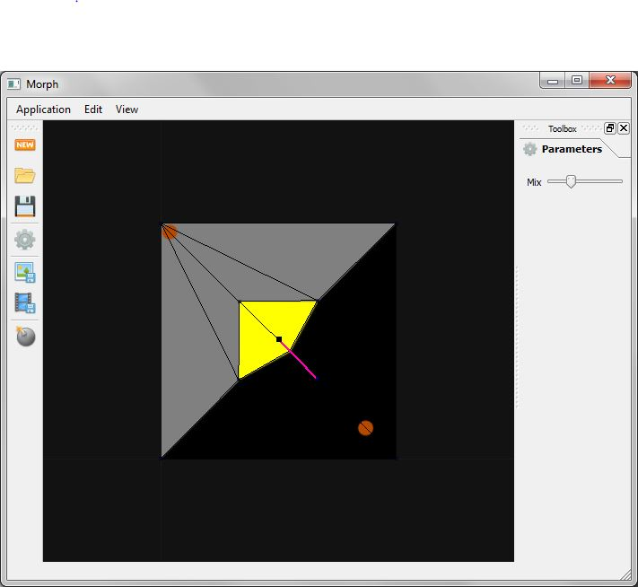

**PyQtMorph**

A fast-interaction morphing tool.

Uses PyQt, PyOpenGL and GLSL shaders to allow entry of many morph target points, suitable for morphing, say, two world maps undergoing continental drift.

Usage:
There are hotkeys, notably "A" and "D" to flip between the two morphing sources. The tilde key "`" does a quick ten frame animation, toggling forward and backward directions to get a good idea of how it's going. 

Use the CNTRL key to drop down new points, and drag along the vector from "A" input to corresponding "B" input.